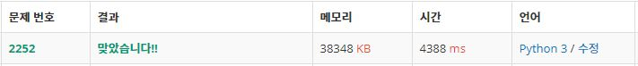
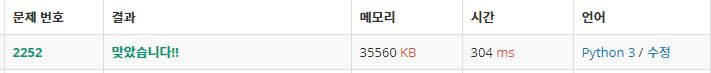

# 1018 위상정렬

## 백준 2258번. 줄 세우기

```python
import sys
def tolosort(x):
    if not vdict[x]:
        vdict[x]=True
        for nb in dict[x]:
            tolosort(nb)
        output.insert(0,x)

# input=sys.stdin.readline
N,M = map(int,input().split())
dict={}
vdict={}
for i in range(1,N+1):
    vdict[i]=False
    dict[i]=[]
for _ in range(M):
    n,m = map(int,input().split())
    dict[n].append(m)
output=[]
for j in range(1,N+1):
    tolosort(j)
for ot in output:
    print(ot, end=' ')
```

딕셔너리 형태로 방문표시와 간선을 표시했는데 결과가 다음과 같았다.




따라서 방문 정보를 일반 list로, 간선을 2차원 array로 저장하고, Queue에서 결과값을 stack하는 방식으로 처리하여 결과를 비교해보았다.



```python
import sys

N,M = map(int,input().split())
v=[0]*(N+1)
line = [[] for _ in range(N+1)]
for _ in range(M):
    i, j = map(int,sys.stdin.readline().strip().split())
    line[i].append(j)
    v[j] +=1
Q=[i for i in range(1,N+1) if v[i]==0]
output=[]
while Q:
    w=Q.pop(0)
    output.append(w)
    for k in line[w]:
        v[k] -=1
        if not v[k]:
            Q.append(k)
print(*output)

```


