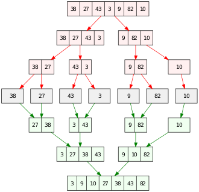

# Merge Sort




```python
def merge(left, right):
    i,j = 0,0
    sorted_list=[]
    while (i<len(left)) & (j<len(right)):
        if left[i] < right[j]:
            sorted_list.append(left[i])
            i+=1
        else:
            sorted_list.append(right[j])
            j+=1
    while i<len(left):    
        sorted_list.append(left[i])
        i+=1
    while j < len(right):
        sorted_list.append(right[j])
        j+=1
    return sorted_list


def merge_sort(lst):
    if len(lst) <=1:
        return lst
    center=len(lst)//2    
    left = lst[:center]
    right = lst[center:]

    left1= merge_sort(left)
    right1= merge_sort(right)
    return merge(left1,right1)

n=int(input())
lst=list(map(int,input().split()))
lst=merge_sort(lst)
```

